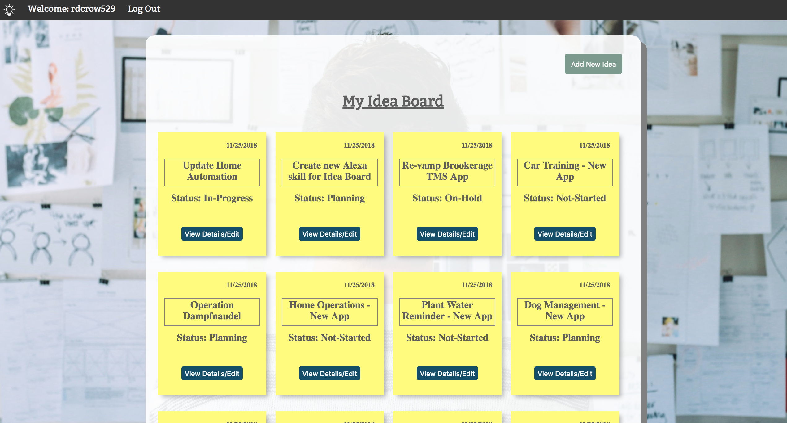
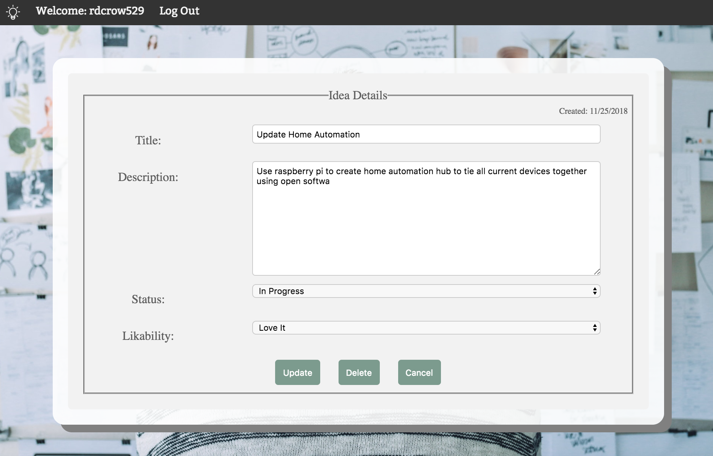
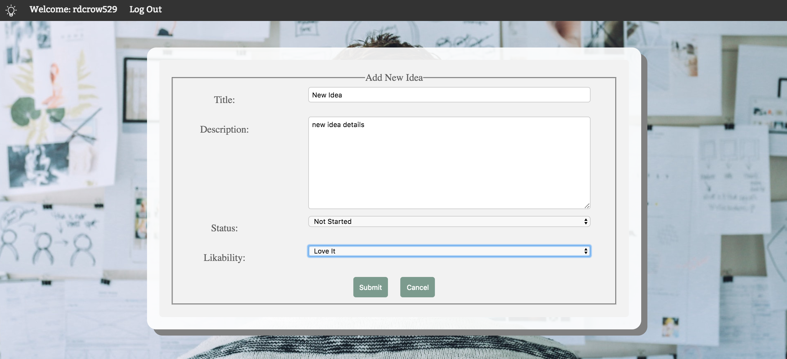

:bulb: # Idea Board :bulb:
[Live demo (Heroku)](https://shrouded-shelf-73200.herokuapp.com/)

Never lose an idea for a project ever again! Idea Board app helps you stay organized by tracking all your ideas in one spot. 

Note: This is a minimum viable product prototype for a larger application. This application was built using Node.js, Express, and MongDB. 

## Motivation

Build an easy-to-use and attractively designed app that demonstrates the following functionalities:

* Idea Board dashboard for quick view of all current ideas and projects
* Add new ideas 
* Track and edit existing ideas

In order to strengthen my core full-stack development capabilities I focused on the following skills:
* Test-driven development (TDD)
* Component-based web app design
* Server-side APIs providing full CRUD capabilities

## Screenshots

### Landing Page

### Log-In

### Sign-Up

### Idea Board Home

### View Idea Details/Update

### Create New Idea

## Technologies used

* Languages/modules:
  * HTML
  * CSS
  * Javascript
  * JQuery
  * Node.js
  * Express
  * Mongoose
* Testing:
  * Mocha
  * Chai
  * Faker
* Development/hosting environment
  * AWS
  * mLab
  * Travis-CI
  * Git(Hub)
  
## Roadmap

When transitioning this app from prototype to production, the following items would be included on the development roadmap:

* Idea Board
    * Include note component which would allow users to add notes for each idea
    * Add additional idea board dashboard capabilities such as filtering by status or likability and basic reports
	
* General
    * Rebuild front-end using React
    * Add account profile
    * Create new Alexa skill for easy way to add new ideas and notes